# Full Data Audit — Every Step the Data Goes Through

> [!NOTE]
> Last updated: 2026-04-23. Reflects per-channel signal splicing across all tabs.

---

## Splice System Overview

Splice definitions are stored per-channel inside each TDT block folder:

| File | Purpose |
|---|---|
| `splices_ch1.txt` | Channel 1 splice regions |
| `splices_ch2.txt` | Channel 2 splice regions |
| `splices.txt` | Legacy fallback (treated as Channel 1) |

Each line: `start_seconds,end_seconds` (raw TDT block time, pre-alignment).

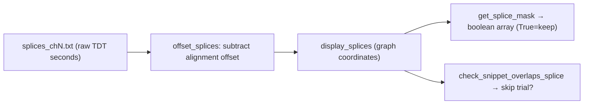

---

## Pipeline 1: Tab 2 — Graph Viewer (`graphApp.py` `compute_trace`)

### Step-by-step data flow

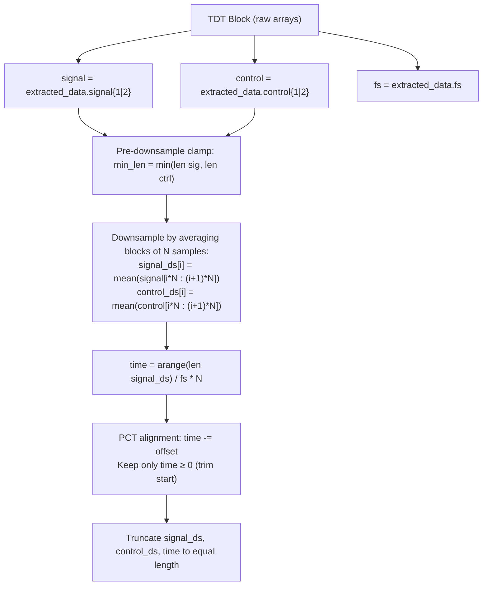

### Regression + ΔF/F + Z-score

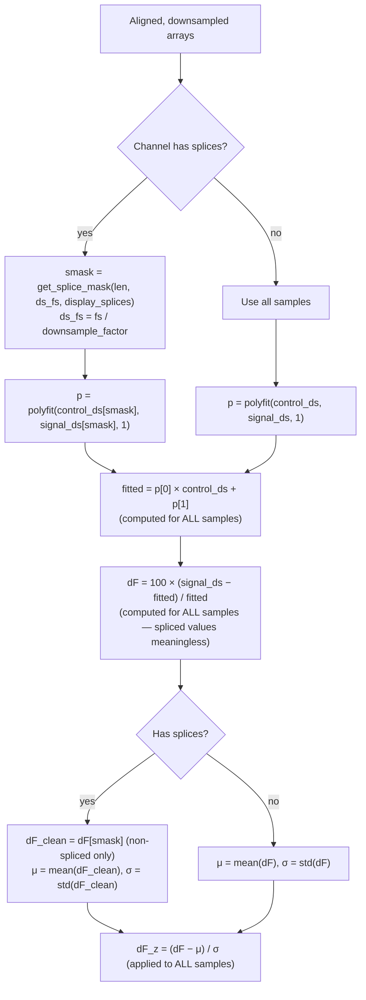

> [!IMPORTANT]
> **polyfit** uses only non-spliced samples → clean regression line.
> **ΔF/F** is computed for ALL samples (spliced values exist but are meaningless).
> **Z-score mean/std** are computed only from non-spliced ΔF/F values.
> **Spliced samples are removed** in Graph 2 and exports (post-computation).

### Graph 1: Full Trace

- Plots `time` vs `dF` or `dF_z` for each channel
- Red `vrect` overlays for Channel 1 splices, orange for Channel 2
- Dashed event lines overlaid

### Graph 2: Spliced Trace

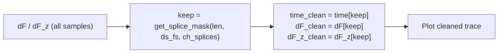

### Exports (CSV / NPZ)

Same masking as Graph 2. Each channel uses its own splice definitions.

| Column | Content |
|---|---|
| `time_s` | Timepoints with spliced samples removed |
| `dF_F_pct` | ΔF/F (%) at each kept timepoint |
| `dF_F_zscore` | Z-scored ΔF/F at each kept timepoint |

---

## Pipeline 2: Tab 3 — Peri-Event Plots (`graphApp.py`)

### Raw Data → ΔF/F

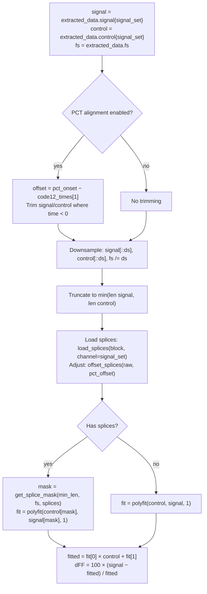

### ΔF/F → Per-Event Snippets

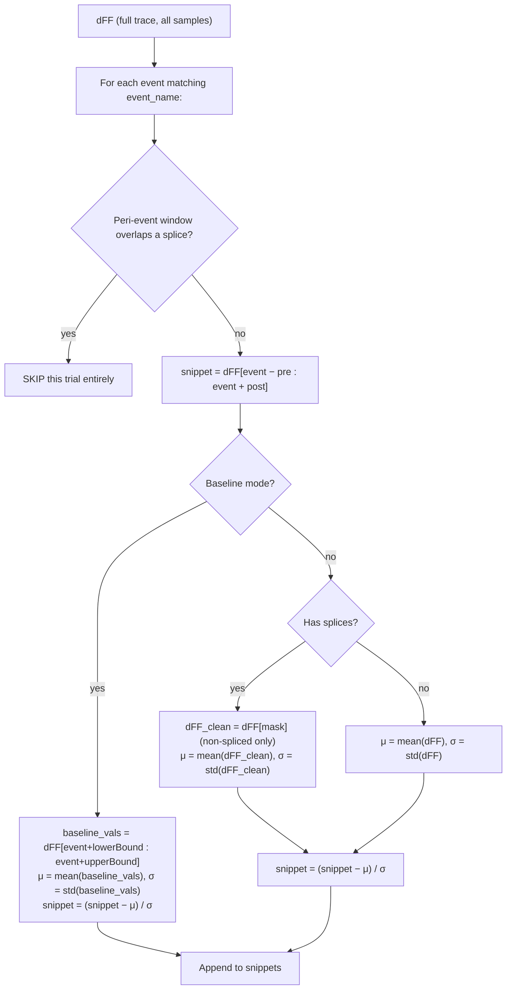

> [!IMPORTANT]
> **Global z-score** mean/std exclude spliced samples from the full trace.
> **Baseline z-score** uses each trial's own baseline window (trials overlapping splices are already skipped, so baseline windows are clean).

### Final Plot

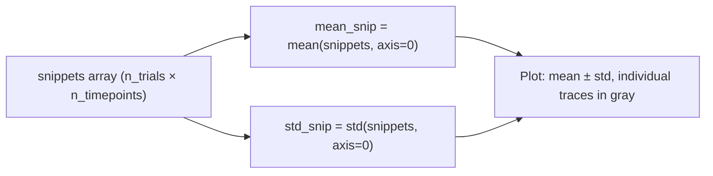

---

## Pipeline 3: Tab 4 — Batch Processing (`batchProcessing.py`)

### Raw Data → ΔF/F

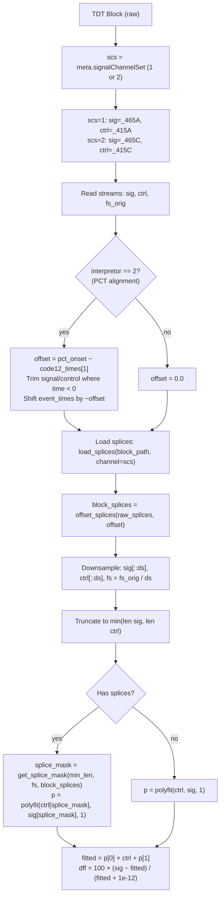

> [!NOTE]
> The `1e-12` epsilon in the denominator prevents division by zero. Tab 2 and Tab 3 do NOT use this epsilon — they divide by `fitted` directly.

### ΔF/F → Per-Trial Z-Scored Snippets

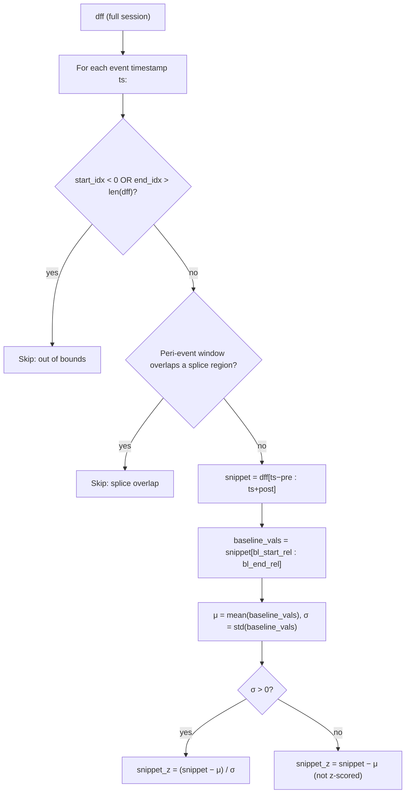

> [!IMPORTANT]
> Batch processing always uses **per-trial baseline z-scoring** (never global). Trials overlapping splice regions are skipped entirely, so baseline windows cannot be contaminated by spliced data.

### Per-Trial Metrics

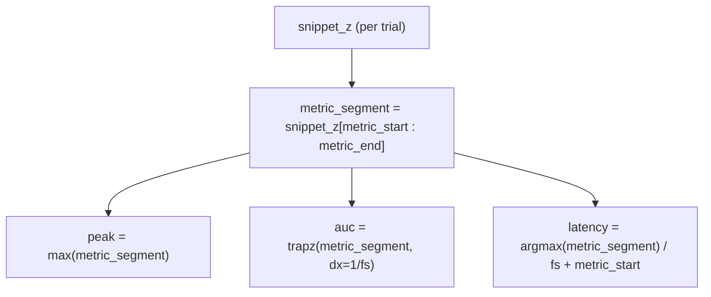

> [!WARNING]
> **AUC uses `dx=1/fs`** (uniform spacing), NOT `np.trapz(y, x)` with time values. Units are **signal_z × seconds**.

---

### Batch Output Files

#### 1. Session Prism CSV (`prism_tables/sessions/{mouse}_{session}_prism.csv`)

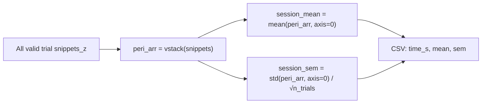

#### 2. Session Metrics CSV (`mice/{mouse}/{session}_metrics.csv`)

**1 row per valid trial**: group, mouse, session, trial_index, peak, auc, latency, n_timepoints, zscored, fs, signalChannelSet.

#### 3. LONG Traces CSV (`mice/{mouse}/{session}_peri_event_traces_LONG.csv`)

**1 row per timepoint per trial**: trial_index, global_time_s, time_idx, time_s, signal_z, mouse, group, session, fs, signalChannelSet.

#### 4. Session Average Plot (`mice/{mouse}/{session}_session_avg.png`)

Line plot: session_mean ± session_sem with vertical line at t=0.

#### 5. Mouse Prism CSV (`prism_tables/mice/{mouse}_combined_prism.csv`)

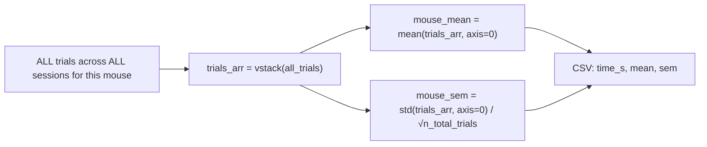

> [!IMPORTANT]
> Pools individual trials, not session means. Sessions with more valid trials carry more weight.

#### 6. Group Summary Metrics CSV (`groups/{group}/{group}_summary_metrics.csv`)

**1 row per mouse**: mean_peak, mean_auc, mean_latency, n_trials — means across all that mouse's trials.

#### 7. Group Mean Trace Plot (`groups/{group}/{group}_mean_trace.png`)

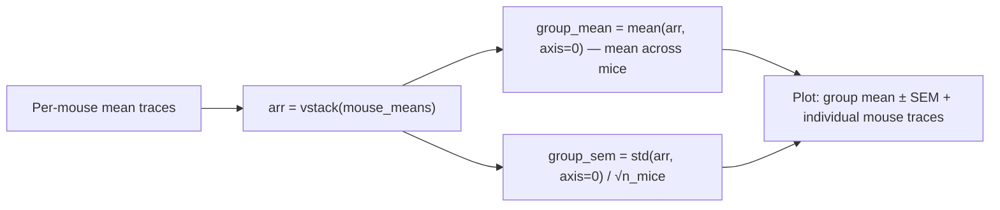

> [!IMPORTANT]
> Group mean = mean of mouse means (each mouse weighted equally).

#### 8. Group Prism CSV (`prism_tables/groups/{group}_group_mean_prism.csv`)

Same data as plot #7: `time_s`, `mean`, `sem`.

#### 9. Group Comparison Plot + CSV

All group means overlaid. CSV columns: `time_s, {group1}_mean, {group1}_sem, ...`

#### 10. Master CSVs

- `all_groups_trial_metrics.csv` — 1 row per trial across everything
- `all_groups_peri_event_traces_LONG.csv` — all LONG DataFrames concatenated

---

## Pipeline 4: Tab 5 — Advanced Graphing (`advanced_graphing.py`)

Operates entirely on CSV outputs from Pipeline 3. **No raw TDT data is re-read.** Splices were already applied during batch processing, so all data is inherently clean.

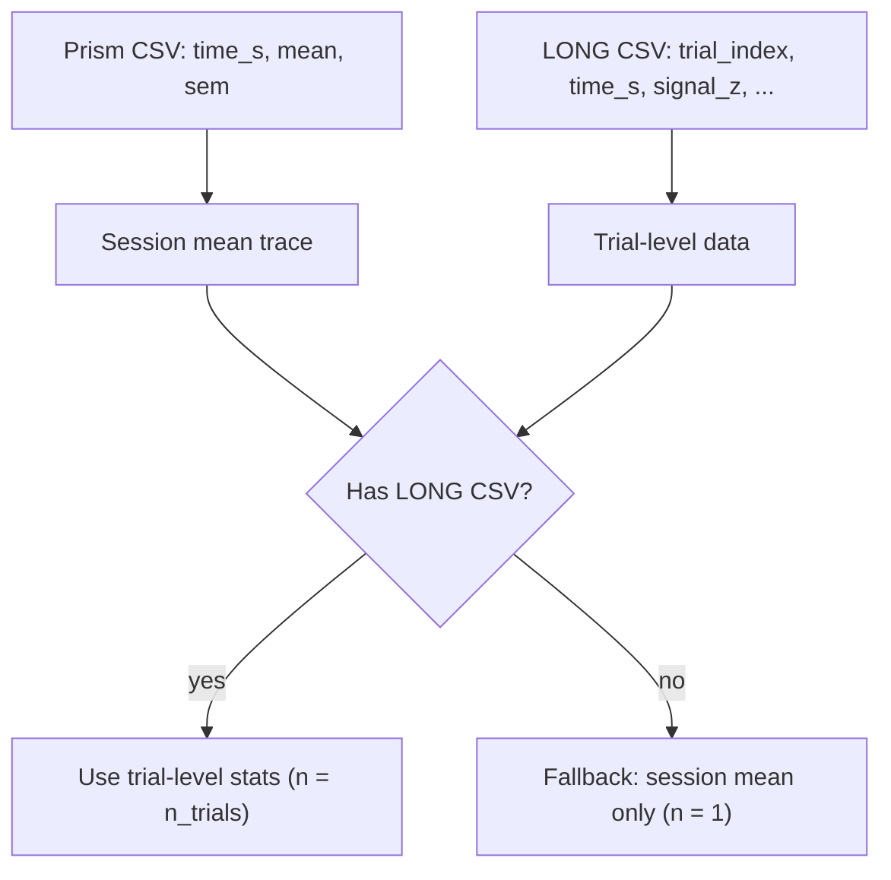

#### Signal Mean Bar Plot

**Math**: For each trial → `mean(signal_z)` in baseline/response window → `mean(trial_means)`, `stddev(trial_means, ddof=0)`.

#### AUC Bar Plot

**Math**: For each trial → `trapz(signal_z, time_s)` in window → `mean(trial_aucs)`, `stddev(trial_aucs, ddof=0)`.

> [!NOTE]
> Uses `np.trapz(y, x)` with actual time values (vs batch processing which uses `dx=1/fs`).

#### Heatmap

Pivot trial data → matrix (rows=trials, cols=timepoints). Color limits: `±percentile(|values|, 98th)`. Colormap: `RdBu_r`.

---

## Known Design Decisions

| Item | Behavior |
|---|---|
| `std(ddof=0)` | Population std used everywhere (NumPy default) |
| Mouse pooling | Trials pooled, not session means — unequal trial counts cause unequal weighting |
| Splice masking vs deletion | Polyfit excludes spliced samples; ΔF/F computed for all; spliced samples removed post-hoc for graphs/exports |
| ΔF/F denominator | Batch uses `fitted + 1e-12`; Tabs 2/3 use `fitted` directly |
| AUC method | Batch: `trapz(y, dx=1/fs)`; Advanced: `trapz(y, x)` |
