# Full Math Audit & Data Flow Documentation

## Pipeline 1: Batch Processing ([batchProcessing.py](file:///d:/Aryan/fiberGrapher/batchProcessing.py))

### Raw Data → dF/F

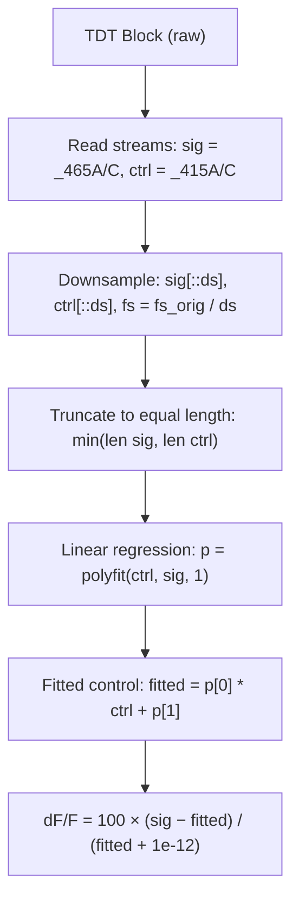

### dF/F → Per-Trial Z-Scored Snippets

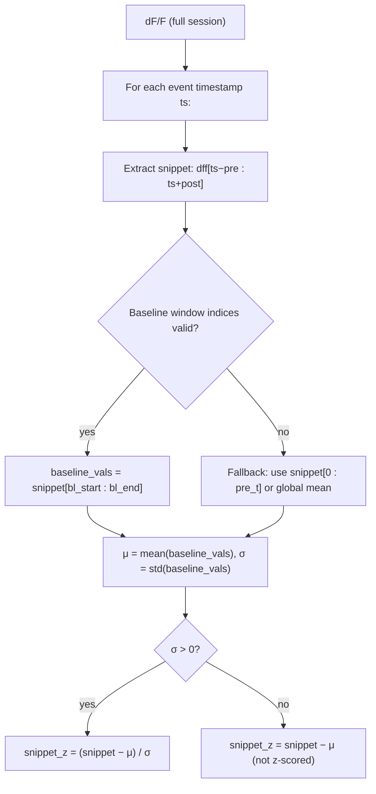

> [!NOTE]
> **Baseline z-scoring**: `std()` uses `ddof=0` (NumPy default = population std). Each trial is independently z-scored against its own baseline window.

### Per-Trial Metrics

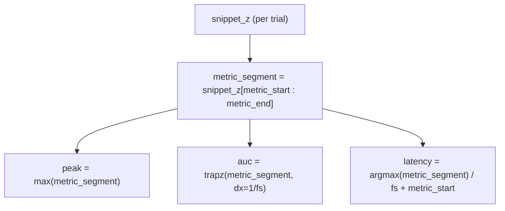

> [!WARNING]
> **AUC uses `dx=1/fs`** (uniform spacing), NOT `np.trapz(y, x)` with actual time values. This is correct IF the snippet is uniformly sampled (which it is after downsampling). However, it means AUC units are **signal_z × seconds**.

---

### Output File Flowcharts

#### 1. Session Prism CSV (`prism_tables/sessions/{mouse}_{session}_prism.csv`)

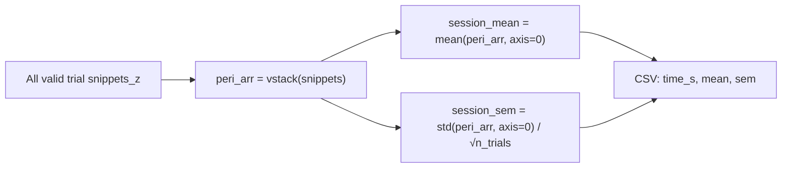

**Columns**: `time_s`, [mean](file:///d:/Aryan/fiberGrapher/advanced_graphing.py#481-528), `sem` — the session-averaged peri-event trace.

#### 2. Session Metrics CSV (`mice/{mouse}/{session}_metrics.csv`)

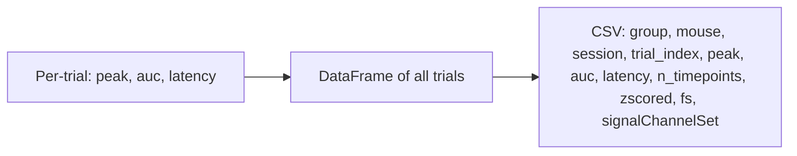

**1 row per trial** with: peak, auc (trapz), latency, zscored flag, fs, signalChannelSet.

#### 3. LONG Traces CSV (`mice/{mouse}/{session}_peri_event_traces_LONG.csv`)

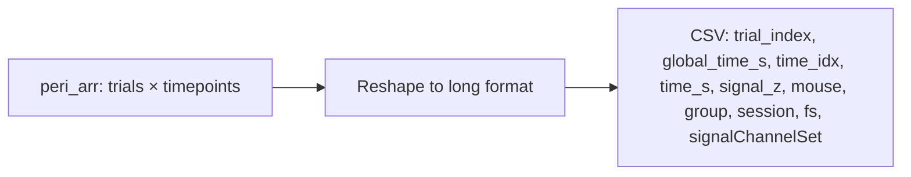

**1 row per timepoint per trial**. The `signal_z` column contains z-scored dF/F values.

#### 4. Session Average Plot (`mice/{mouse}/{session}_session_avg.png`)

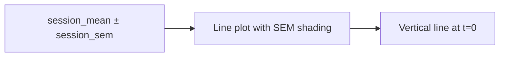

#### 5. Mouse Prism CSV (`prism_tables/mice/{mouse}_combined_prism.csv`)

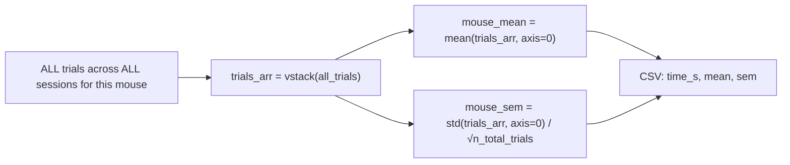

> [!IMPORTANT]
> **This pools individual trials, not session means.** If Mouse1 has 10 trials from Session1 and 5 from Session2, the mouse mean is computed across all 15 trials — Session1 carries double the weight.

#### 6. Group Summary Metrics CSV (`groups/{group}/{group}_summary_metrics.csv`)

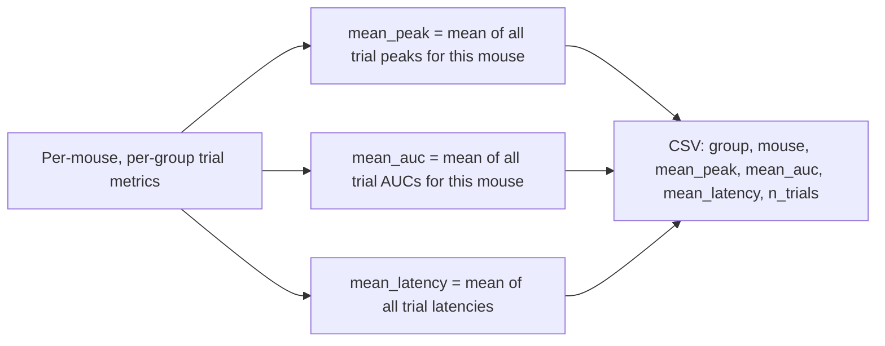

**1 row per mouse** in the group. Metrics are means across all trials (not session means).

#### 7. Group Mean Trace Plot (`groups/{group}/{group}_mean_trace.png`)

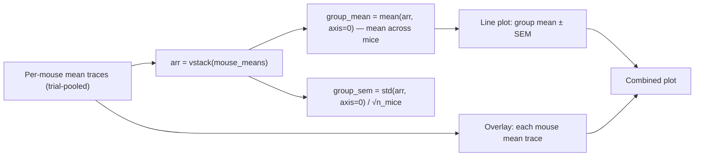

> [!IMPORTANT]
> **Group mean is mean of mouse means** (each mouse weighted equally), which is correct for between-subjects analysis.

#### 8. Group Prism CSV (`prism_tables/groups/{group}_group_mean_prism.csv`)

Same data as plot #7: `time_s`, [mean](file:///d:/Aryan/fiberGrapher/advanced_graphing.py#481-528), `sem` — group-averaged trace.

#### 9. Group Comparison Plot (`comparison/{event}_group_comparison.png`)

#### 10. Group Comparison Prism CSV (`prism_tables/comparison/{event}_group_comparison_prism.csv`)

**Columns**: `time_s, {group1}_mean, {group1}_sem, {group2}_mean, {group2}_sem, ...`

#### 11. Master Trial Metrics CSV (`all_groups_trial_metrics.csv`)

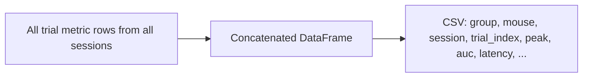

**1 row per trial across ALL mice and sessions.**

#### 12. Master LONG Traces CSV (`all_groups_peri_event_traces_LONG.csv`)

All individual session LONG DataFrames concatenated. **1 row per timepoint per trial across everything.**

---

## Pipeline 2: Advanced Graphing ([advanced_graphing.py](file:///d:/Aryan/fiberGrapher/advanced_graphing.py))

This pipeline reads CSVs from Pipeline 1 and generates additional visualizations.

### Input Data Sources

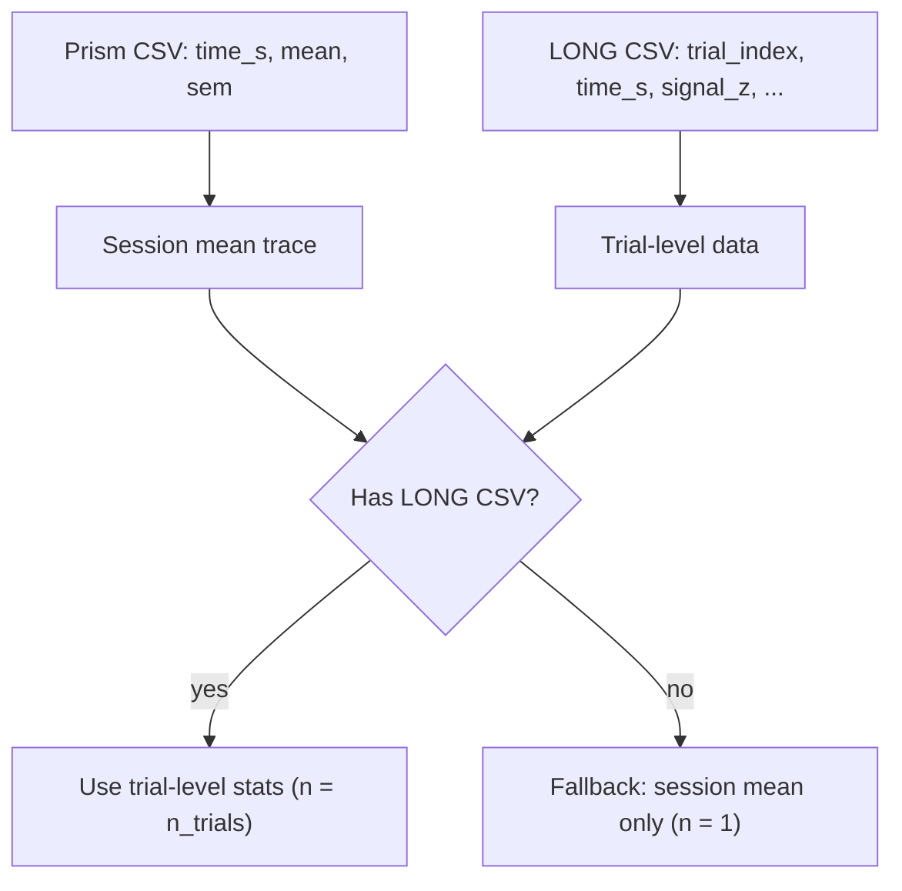

#### Signal Mean Bar Plot (`*_signal_mean_bars.png`)

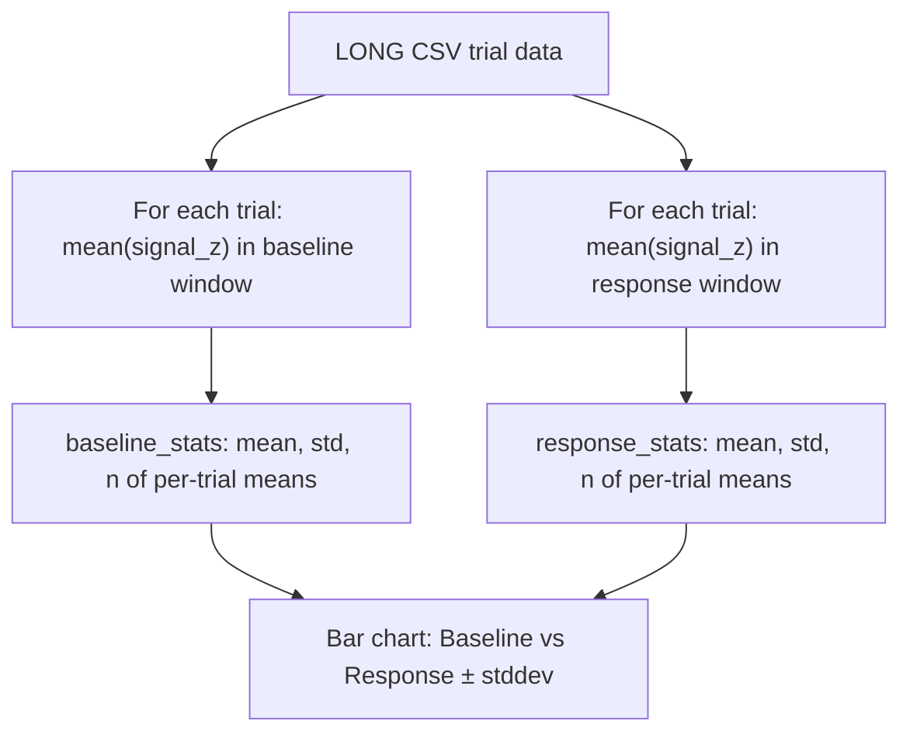

**Math**: `trial_means[i] = mean(signal_z[t ∈ window])` per trial → `mean = mean(trial_means)`, `stddev = std(trial_means, ddof=0)`

#### AUC Bar Plot (`*_auc_bars.png`)

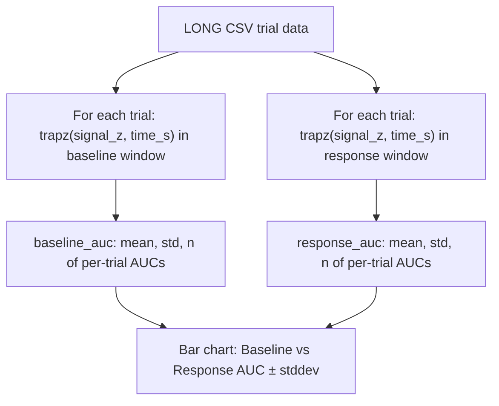

**Math**: `trial_aucs[i] = trapz(signal_z, time_s)` per trial → `mean = mean(trial_aucs)`, `stddev = std(trial_aucs, ddof=0)`

> [!NOTE]
> Unlike batchProcessing which uses `dx=1/fs`, advanced_graphing uses `np.trapz(y, x)` with actual time values. Both are correct but use slightly different integration methods.

#### Heatmap (`*_heatmap.png`)

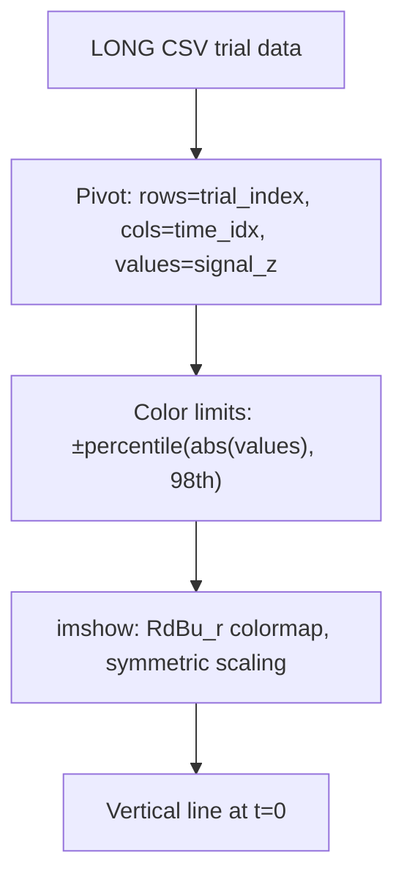

#### Session Stats CSV (`*_stats.csv`)

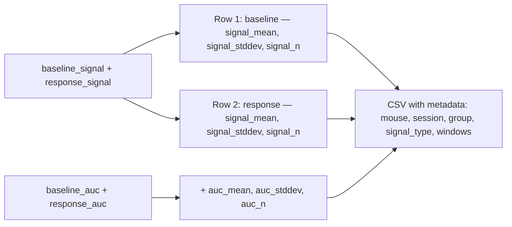

#### Aggregated Stats CSV (`aggregated_session_stats.csv`)

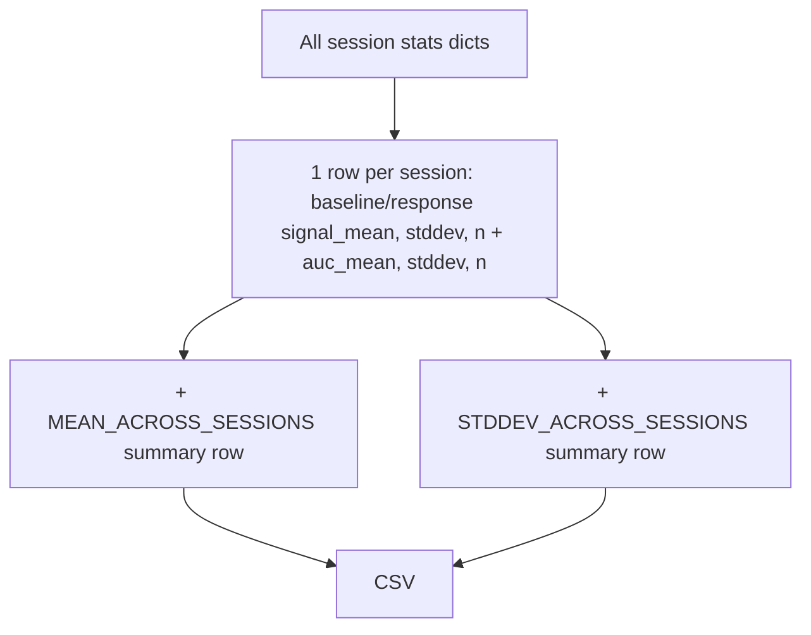

> [!WARNING]
> The summary rows compute [mean()](file:///d:/Aryan/fiberGrapher/advanced_graphing.py#481-528)/`std()` of the per-session **n** column too, which is meaningless (it averages the trial counts). Consider dropping `n` columns from the summary computation.

---

## Issues Found

### 1. Group summary metrics source data mismatch

In [batchProcessing.py](file:///d:/Aryan/fiberGrapher/batchProcessing.py) lines 534–540, the `per_group_mouse_metrics_rows` are built from `per_mouse_summary_metrics_by_group`, which stores the **per-trial** metric rows (peak, auc, latency). These metrics come from the **z-scored snippet** computed per-trial during batch processing.

The user requested these metrics come from the **prism data** instead. Currently the prism CSV only stores `time_s, mean, sem` (the session-averaged trace) — it doesn't contain per-trial metrics like peak/auc/latency.

**To use prism data for summary metrics**: We could compute peak/auc/latency from the prism session mean trace, but this would give one value per session (not per trial). This changes the meaning of `n_trials` in the summary.

### 2. `std(ddof=0)` used throughout

Both pipelines use population standard deviation. This is consistent but worth noting — some scientific conventions prefer `ddof=1` (sample std) or SEM.

### 3. Mouse-level pooling weights trials, not sessions

When computing mouse-mean traces, all trials are pooled equally. A session with 20 trials has 4× the weight of a session with 5 trials. This is a design choice, not a bug — but different from computing session means first, then averaging (which weights sessions equally).
